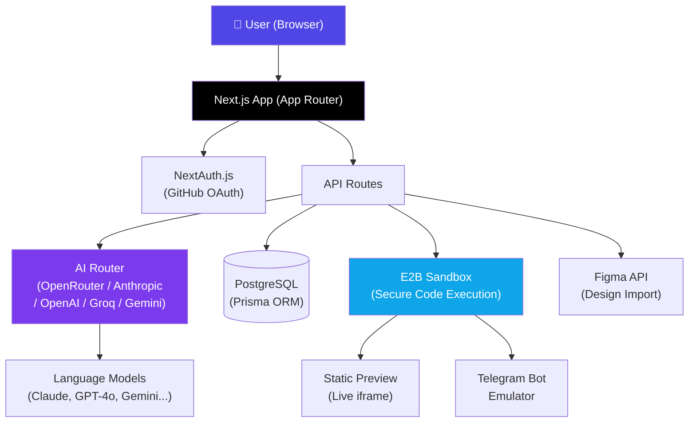

<div align="center">

# 🧠 AssisCore

**A next-generation browser-based IDE powered by AI.**  
Turn any idea into a working website, web app, or Telegram bot — just by having a conversation.

[](https://github.com/serzh218/assiscore/actions/workflows/ci.yml)
[](LICENSE)
[](CONTRIBUTING.md)
[](package.json)
[](https://nextjs.org/)
[](https://www.typescriptlang.org/)

</div>

---

## 🚀 What is AssisCore?

AssisCore is an **AI-native development environment** that runs entirely in the browser. It lets anyone — from beginners to professionals — go from idea to a working digital product in minutes, not weeks.

Instead of writing boilerplate and fighting configuration, you simply **describe what you want** and our AI assistant builds it, shows it live, and keeps iterating based on your feedback.

### Why AssisCore?

- ⚡ **Speed** — From idea to working MVP in minutes, not weeks
- 🌍 **Accessibility** — Removes the barrier between beginners and professional-grade results  
- 🔍 **Transparency** — You always own clean, readable, exportable source code
- 🎯 **Adaptability** — The interface adapts to the type of project you're building

---

## ✨ Key Features

| Feature | Description |
|---|---|
| 🤖 **AI Code Generation** | Describe your project in natural language — the AI generates a complete, working file structure |
| 👁️ **Live Preview** | Instantly see your website or web app update as changes are made |
| 📱 **Telegram Bot Emulator** | Test your bot logic in a realistic phone-like simulator, in real-time |
| 🗂️ **Integrated File Editor** | Browse, view, and edit every generated file in the built-in code editor |
| 💬 **Conversational Iteration** | Refine your project via chat: *"Make the background darker"*, *"Add a contact button to the nav"* |
| 🔒 **Sandboxed Execution** | Code runs in secure E2B cloud sandboxes — completely isolated from your machine |
| 📤 **Export Anywhere** | Download the full source code as a ZIP or push directly to GitHub |
| 🎨 **Figma Import** | Import designs from Figma and turn them into working code |
| 📊 **Token & Billing System** | Transparent usage tracking with free and PRO tiers |

---

## 🏗️ Architecture



---

## 💻 Tech Stack

| Layer | Technology |
|---|---|
| **Frontend** | Next.js 15 (App Router), React 19, TypeScript, Tailwind CSS v4, shadcn/ui, Framer Motion |
| **Backend** | Next.js API Routes, Node.js, Custom WebSocket server |
| **Database** | PostgreSQL + Prisma ORM |
| **AI Providers** | OpenRouter, Anthropic Claude, OpenAI GPT, Google Gemini, Groq (via Vercel AI SDK) |
| **Sandboxing** | [E2B](https://e2b.dev) — secure cloud sandboxes for code execution |
| **Auth** | NextAuth.js (GitHub OAuth + email/password) |
| **Testing** | Vitest, jsdom |
| **Observability** | OpenTelemetry, Pino logger, Prometheus metrics |
| **DevOps** | Docker, Docker Compose, Fly.io, GitHub Actions CI |
| **i18n** | next-intl (internationalization support) |

---

## 🛠️ Local Development

### Prerequisites

- Node.js ≥ 20
- pnpm ≥ 8
- Docker & Docker Compose (for local database)
- API keys (see `.env.example`)

### 1. Clone the repository

```bash
git clone https://github.com/serzh218/assiscore.git
cd assiscore
```

### 2. Install dependencies

```bash
pnpm install
```

### 3. Set up environment variables

```bash
cp .env.example .env
```

Open `.env` and fill in at least:
- `DATABASE_URL` (pre-filled for Docker setup below)
- `E2B_API_KEY` — get at [e2b.dev](https://e2b.dev)
- One AI provider key (e.g., `OPENROUTER_API_KEY` or `ANTHROPIC_API_KEY`)
- `NEXTAUTH_SECRET` — any random string (e.g., `openssl rand -base64 32`)

### 4. Start the database

```bash
docker compose up -d db
```

### 5. Run migrations and seed demo data

```bash
pnpm prisma:migrate
pnpm prisma:gen
pnpm db:seed
```

### 6. Start the dev server

```bash
pnpm dev
```

Open [http://localhost:3000](http://localhost:3000) — you're ready to go! 🎉

### 7. Quality checks

```bash
# Run all checks (typecheck → lint → tests → build)
pnpm dx:check

# Tests only
pnpm test

# Linting only
pnpm lint
```

---

## 🐳 Docker Setup (Full Stack)

Run the entire stack with Docker Compose:

```bash
docker compose up --build
```

This starts the Next.js application and PostgreSQL together. Configure your `.env` accordingly.

---

## 📁 Project Structure

```
assiscore/
├── app/                  # Next.js App Router pages & layouts
├── auth/                 # Authentication logic (NextAuth config)
├── components/           # Reusable React components
│   ├── editor/           # Code editor components
│   ├── preview/          # Live preview components
│   └── ui/               # Base UI components (shadcn/ui based)
├── config/               # App-wide configuration constants
├── docs/                 # Developer documentation
├── i18n/                 # Internationalization (translations)
├── lib/                  # Shared utilities
│   ├── ai/               # AI prompt builders & parsers
│   └── tokens.ts         # Token accounting utilities
├── prisma/               # Database schema & migrations
│   └── schema.prisma
├── public/               # Static assets
├── scripts/              # Dev scripts (seed, i18n-check, etc.)
├── server/               # Server-only logic
│   ├── ai/               # LLM integration & code generation pipeline
│   ├── billing/          # Plans, entitlements, token transactions
│   └── guards/           # Rate limiting & limit guards
├── templates/            # Project scaffolding templates
├── tests/                # Integration & unit tests
├── types/                # Shared TypeScript types
├── Dockerfile
├── docker-compose.yml
└── next.config.ts
```

---

## 🤖 How AI Code Generation Works

1. **User describes their project** — they pick a type (Website / Web App / Telegram Bot) and describe what they want
2. **LLM generates a file bundle** — the AI selects an appropriate template and returns a complete set of files
3. **Files are validated and applied** — the system validates the output, detects the package manager, and applies the changes
4. **E2B sandbox builds a preview** — code is bundled in a secure cloud sandbox and served as a live iframe
5. **User iterates via chat** — subsequent messages apply unified diffs, with preview/reject before committing

> **Important protected files:** `.env` and Prisma migration files are write-protected by the AI pipeline to prevent accidental damage.

---

## 🗺️ Roadmap

See [ROADMAP.md](ROADMAP.md) for the full list of planned features and open issues.

**Current focus (v0.2):**
- [ ] Multi-file diff preview before applying AI changes
- [ ] Collaborative editing (multiple users on one project)
- [ ] Plugin system for custom AI providers
- [ ] Mobile-friendly layout for the studio
- [ ] VS Code extension for local sync

---

## 🤝 Contributing

Contributions are very welcome! Please read [CONTRIBUTING.md](CONTRIBUTING.md) to get started.

**Quick start:**
1. Fork the repository
2. Create a feature branch: `git checkout -b feature/your-feature`
3. Commit your changes: `git commit -m 'feat: add amazing feature'`
4. Push and open a Pull Request

---

## 🔐 Security

- Sensitive files (`.env`, Prisma migrations) are protected from AI edits
- All code generation runs in isolated [E2B](https://e2b.dev) sandboxes
- Never commit real API keys — always use `.env` (git-ignored)

To report a security vulnerability, please open a [private security advisory](https://github.com/serzh218/assiscore/security/advisories/new).

---

## 📄 License

This project is licensed under the [MIT License](LICENSE).

---

<div align="center">
  Built with ❤️ — open to contributions, ideas, and collaboration.
</div>
